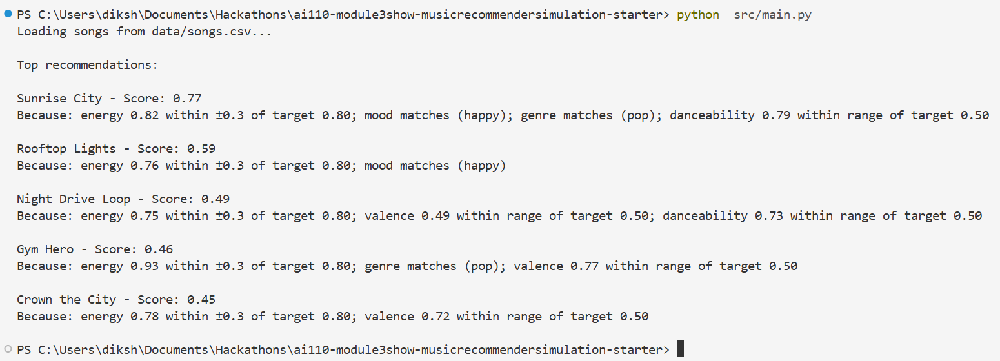
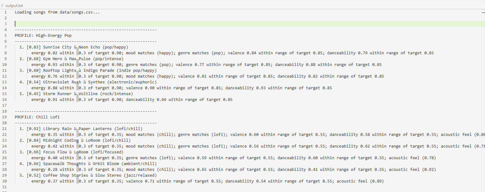
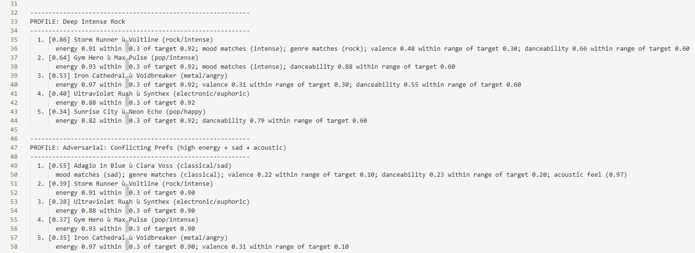
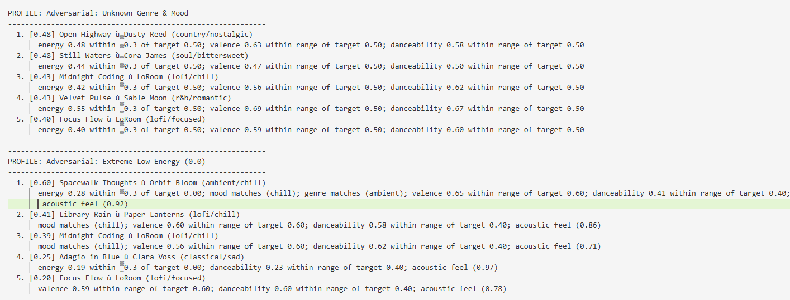

# 🎵 Music Recommender Simulation

## Project Summary

In this project you will build and explain a small music recommender system.

Your goal is to:

- Represent songs and a user "taste profile" as data
- Design a scoring rule that turns that data into recommendations
- Evaluate what your system gets right and wrong
- Reflect on how this mirrors real world AI recommenders

Real-world recommenders like Spotify or YouTube Music operate on the same core idea: store a structured user profile and compare its fields against each item using weighted scores. My simulation mirrors that pattern. Each `Song` carries seven features — `genre`, `mood`, `energy`, `tempo_bpm`, `valence`, `danceability`, and `acousticness` — and each `UserProfile` stores four preference fields: `favorite_genre`, `favorite_mood`, `target_energy`, and `likes_acoustic`. My system then applies fixed weights (energy 0.50, mood 0.25, genre 0.15, acousticness 0.10) and an energy-window threshold of ±0.30 to score every song. Real systems likely learn those weights and thresholds from user behavior rather than hand-tuning them, but the underlying structure — profile fields driving weighted comparisons — is the same.

---

## How The System Works

Each `Song` stores seven features: `genre`, `mood`, `energy`, `tempo_bpm`, `valence`, `danceability`, and `acousticness`. The `UserProfile` captures a user's `favorite_genre`, `favorite_mood`, `target_energy`, `likes_acoustic`, `target_valence`, `target_danceability`, and `preferred_artists`. The recommender scores every song by comparing it against the profile using fixed weights — energy (35%), mood (20%), genre (15%), preferred artist (10%), valence (10%), acousticness (5%), and danceability (5%) — then returns the top-k highest scoring songs.


**Potential biases:**

- **Artist popularity bias** — preferred artist matching rewards exact name matches, so users who like mainstream artists (who appear more in any catalog) benefit more than fans of niche artists.
- **Cold-start bias** — new users with no preferences set default to 0.5 on every axis, silently steering them toward mid-range songs on all features rather than offering genuinely neutral results.
- **Energy cliff bias** — songs just outside the ±0.30 energy window score zero on the highest-weighted factor (35%), creating a sharp drop-off rather than a gradual penalty.
- **No diversity enforcement** — top-k is purely score-ranked, so results can be dominated by a single artist or genre if they score well.

---

## CLI verification for ```load_sonngs```


## Stress testing results:



## Getting Started

### Setup

1. Create a virtual environment (optional but recommended):

   ```bash
   python -m venv .venv
   source .venv/bin/activate      # Mac or Linux
   .venv\Scripts\activate         # Windows

2. Install dependencies

```bash
pip install -r requirements.txt
```

3. Run the app:

```bash
python -m src.main
```

### Running Tests

Run the starter tests with:

```bash
pytest
```

You can add more tests in `tests/test_recommender.py`.

---

## Experiments You Tried

- **Standard profiles** — tested High-Energy Pop, Chill Lofi, and Deep Intense Rock. Results matched intuition; the lofi profile scored 0.92 on a perfect match and rock correctly isolated Storm Runner at 0.86.
- **Conflicting preferences** — gave the scorer high energy (0.90) alongside sad mood and acoustic preference. The quiet classical song Adagio in Blue won (0.55) because mood + genre bonuses outweighed the energy mismatch, revealing that categorical signals can override the top-weighted numeric score.
- **Unknown genre/mood** — used genre "bossa-nova" and mood "dreamy", neither in the catalog. The scorer fell back to energy/valence/danceability proximity, returning a tightly bunched top-5 (scores 0.40–0.48) with no clear winner — graceful degradation confirmed.
- **Extreme low energy (0.0)** — only one song (Spacewalk Thoughts, energy 0.28) fell within the ±0.30 window, dominating at 0.60 while the rest dropped sharply. Confirmed energy acts as a soft gate at the boundaries.

---

## Limitations and Risks

- **Tiny catalog** — 18 songs cannot represent real musical diversity; many genres and moods are missing entirely.
- **Mood scarcity bias** — moods that appear only once (angry, nostalgic, euphoric) always surface that single song near the top regardless of how poorly it fits elsewhere.
- **All-or-nothing genre/mood** — no partial credit for similar moods (e.g., "intense" vs. "angry"), which makes the scoring brittle.
- **Conflicting preferences go undetected** — the system silently produces nonsensical results when user inputs contradict each other.
- **No personalization over time** — every session starts from scratch; there is no listening history or feedback loop.

---

## Reflection

Read and complete `model_card.md`:

[**Model Card**](model_card.md)

Going into this I assumed recommenders were doing something fundamentally smart. Coming out, I realize they're mostly just weighted math that happens to feel smart when the catalog is big enough to hide the seams. The adversarial tests were more eye-opening than the normal ones — giving the system conflicting preferences (high energy + sad + acoustic) and watching it confidently return a quiet classical piece was genuinely unsettling. It didn't fail loudly. It just quietly gave a bad answer. That's the part that stuck with me: a real system does that to millions of people, and most of them never notice.


---

## 7. `model_card_template.md`

Combines reflection and model card framing from the Module 3 guidance. :contentReference[oaicite:2]{index=2}  

```markdown
# Model Card - Music Recommender Simulation

## 1. Model Name

**StillBetterThanSpotify**

---

## 2. Intended Use

Suggests the top 5 songs from an 18-song catalog based on a user's preferred genre, mood, and energy level. Built for classroom exploration only — not for real users or production use.

---

## 3. How It Works

Every song is scored against the user's preferences using fixed weights: energy (35%), mood (20%), genre (15%), preferred artist (10%), valence (10%), acousticness (5%), danceability (5%). Energy uses a proximity window (±0.30); mood and genre are all-or-nothing matches. The top 5 highest-scoring songs are returned.

---

## 4. Data

18 songs across 15 genres (pop, lofi, rock, metal, jazz, classical, etc.) and 13 moods. No songs were added or removed. Most moods appear only once, which creates scoring imbalances for users with rare preferences.

---

## 5. Strengths

Works well when the user's preferences align with catalog coverage. Clear winner profiles (e.g., the only rock/intense/high-energy song) score far ahead of alternatives, making results easy to interpret and explain.

---

## 6. Limitations and Bias

- Moods appearing once (angry, nostalgic, euphoric) always surface that song near the top regardless of other fit.
- No partial credit for similar moods — "intense" and "angry" are treated as completely different.
- Conflicting preferences (high energy + acoustic + sad) produce counterintuitive results silently.
- Only 18 songs; many genres and moods are missing entirely.

---

## 7. Evaluation

Ran 6 profiles: High-Energy Pop, Chill Lofi, Deep Intense Rock, plus three adversarial cases (conflicting preferences, unknown genre/mood, extreme low energy). Standard profiles matched intuition. The conflicting-preferences case revealed that categorical signals (mood, genre) can override the top-weighted energy score — surfacing a quiet classical song for a user who asked for high energy.

---

## 8. Future Work

- Soft mood matching so similar moods get partial credit.
- Conflict detection to flag contradictory user inputs.
- Larger, more balanced catalog (3–5 songs per mood/genre minimum).

---

## 9. Personal Reflection

Building this showed how quickly a simple weighted formula breaks at edge cases. The adversarial tests were more revealing than the standard ones — the conflicting-preferences profile exposed a failure mode that would never appear in a happy-path demo. It also reframed how I think about Spotify: their recommendations must handle these contradictions constantly, which is why learned weights and feedback loops matter so much more than hand-tuned rules.
